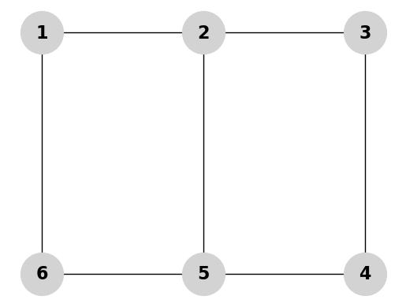

# 算法简介

该项目主要实现了"Reducing the CNOT count for Clifford+T circuits on NISQ architectures" [^1]中的linear reversible 电路综合，并在此基础上实现了phase polynomial 电路的综合。

## linear reversible 电路综合

所有的量子门都满足reversible。线性函数或线性门电路计算的函数 `f` 被定义为：对于所有的 $x_1, x_2$ 在有限域 $\mathbb{F}_2^n$ 中，满足 $f(x_1 \oplus x_2) = f(x_1) \oplus f(x_2)$[^2]。CNOT门是一个线性门电路的例子。在这篇工作[^3]前，对于由CNOT电路组成的linear reversible电路，当硬件比特全联通时，这篇工作[^2]实现了最优算法，最坏复杂度为 $O(\frac{n^2}{\log{n}})$，其中$n$为量子比特个数。而[^4]中证明了在全联通下，对于 n 个量子位的linear reversible变换，最佳电路的大小为$\Omega(\frac{n^2}{\log_2{n}})$。 因此，[^2] 中的方法在最坏情况下在乘法常数范围内是最佳的。但是当考虑比特不是全联通时，并插入SWAP门来实现电路时，[^2]中的算法复杂度变为$O(\frac{n^3}{\log{n}})$。
对于量子比特连接性受限的情况，[^3]利用图论中的steiner tree问题[^5]，降低了传递状态的比特数量，从而使得算法复杂度降为$O(n^2)$。之后[^1]又在部分操作上进行了少量优化。

### linear reversible 综合算法

算法输入为表示linear transform的矩阵和表示量子比特连接性的图。
一个CNOT的linear transform矩阵是对单位矩阵进行的行变换。具体来说是将表示控制比特的行加到表示目标比特的行。
如下式所示，$A$是一个linear transform矩阵，算法的目标是找到一个行变换序列，即$\{G_6,G_5,G_4,G_3,G_2,G_1\}$使得$A$变回单位向量。进一步实现$\{G_1,G_2,G_2,G_4,G_5,G_6\}$表示的CNOT序列，就实现了$A$表示的linear transform。

$$
A =
\begin{bmatrix}
1 & 0 & 1 & 0 \\
0 & 0 & 1 & 0 \\
1 & 1 & 1 & 0 \\
1 & 1 & 0 & 1 \\
\end{bmatrix}\\= G_6 \cdot G_5 \cdot G_4 \cdot G_3 \cdot G_2 \cdot G_1 \\= \begin{bmatrix}
1 & 0 & 0 & 0 \\
0 & 1 & 0 & 0 \\
0 & 0 & 1 & 0 \\
0 & 0 & 0 & 1 \\
\end{bmatrix}\cdot
\begin{bmatrix}
1 & 1 & 0 & 0 \\
0 & 1 & 0 & 0 \\
0 & 0 & 1 & 0 \\
0 & 0 & 0 & 1 \\
\end{bmatrix}
\cdot
\begin{bmatrix}
1 & 0 & 0 & 0 \\
0 & 1 & 1 & 0 \\
0 & 0 & 0 & 1 \\
0 & 0 & 0 & 1 \\
\end{bmatrix}
\cdot
\begin{bmatrix}
1 & 0 & 0 & 0 \\
0 & 1 & 0 & 0 \\
0 & 1 & 1 & 0 \\
0 & 0 & 0 & 1 \\
\end{bmatrix}
\cdot
\begin{bmatrix}
1 & 0 & 0 & 0 \\
0 & 1 & 0 & 0 \\
0 & 0 & 1 & 0 \\
0 & 0 & 1 & 1 \\
\end{bmatrix}
\cdot
\begin{bmatrix}
1 & 0 & 0 & 0 \\
1 & 1 & 0 & 0 \\
0 & 0 & 1 & 0 \\
0 & 0 & 0 & 1 \\
\end{bmatrix}\\
$$

### 算法过程

1. 从矩阵第一列开始，设列索引 `i = 1`。
2. 如果矩阵中 `(i,i)`等于0，那么找到所有行 `j`使得 `(j,i)`等于1且 `j > i`。选择在连通性图中到 `i`的最短路径的 `j`，并使用这条路径通过一系列允许的行操作将行 `j`加到行 `i`。
3. 找到在列 `i`的条目等于1的行 `i`以下的所有行。从与这些行以及节点 `i`相关联的节点创建终端集合 `S`。
4. 找到以连通图 `G`和终端 `S`为基础的steiner近似图。
5. 使用steiner tree进行行操作。执行这些操作并计算结果矩阵。
6. 在下一列重复步骤2-5，直到矩阵为上三角形式。
7. 对矩阵进行转置并重复上述步骤。

其中steiner tree问题是指对一个图，寻找到路径最短的树，连接一个已知的点子集 `terminals`。当不考虑不同量子比特的连通性差距，即图上边的长度都相等时，问题可以转换为应用最少的点，将目标的 `terminals`连接起来。由于该问题为NP问题，因此算法中只使用近似解。
其中[^1]对[^3]中的第5步进行了改进，优化了行操作的生成。比如对下面的例子，[^3]使用了43个CNOT，[^1]使用了26个CNOT。（目前项目中该例子使用了27个CNOT，需要对steiner tree的生成进行进一步优化。）

$$
A = 
\begin{bmatrix}
1 & 1 & 0 & 1 & 1 & 0 \\
0 & 0 & 1 & 1 & 0 & 1 \\
1 & 0 & 1 & 0 & 1 & 0 \\
1 & 1 & 0 & 1 & 0 & 0 \\
1 & 1 & 1 & 1 & 0 & 0 \\
0 & 1 & 0 & 1 & 0 & 1 \\
\end{bmatrix}\\
$$

## phase polynomial 电路综合

对于只由$\{CNOT,T\}$组成的电路$U$，都有：
$$U \left| x_1 x_2 \ldots x_n \right\rangle = \omega^{p(x_1,x_2,\ldots,x_n)} \left| g(x_1, x_2, \ldots, x_n) \right\rangle
$$
其中$\omega = e^{\frac{i\pi}{4}}$,$x_1, x_2, \ldots, x_n \in \mathbb{F}_2$，$g$为$\mathbb{F}_2^n \rightarrow \mathbb{F}_2^n$的linear reversible 变换。而
$$p(x_1, x_2, \ldots, x_n) = \sum_{i=1}^{\ell} c_i \cdot f_i(x_1, x_2, \ldots, x_n)$$
，$f_1, f_2, \ldots, f_{\ell}$在$ (\mathbb{F}_2^n)$的布尔函数, $ c_1, c_2, \ldots, c_{\ell}$是$\mathbb{Z}_8
$的系数。
$g$的实现可以直接使用linear reversible 电路综合，而函数$p$也可以在一系列变化后，应用linear reversible 电路综合方法。因此可以将linear reversible 电路综合中的方法推广到phase polynomial 电路综合。
具体来说，先生成$p$的综合电路，此时电路$U'$为
$$U' \left| x_1 x_2 \ldots x_n \right\rangle = \omega^{p(x_1,x_2,\ldots,x_n)} \left| g'(x_1, x_2, \ldots, x_n) \right\rangle
$$
由于$g'$也是linear reversible,因此存在$g''$使得$g''(g'(x_1, x_2, \ldots, x_n))= g(x_1, x_2, \ldots, x_n)$。在$U'$的基础上实现$g''$，就可以得到$U$。因此算法关键是函数$p$的综合，也可以称为Parity network综合。

### Parity network 综合输入
算法的输入为一个奇偶校验网络矩阵和表示量子比特连接性的图。矩阵的列表示$f_i$，矩阵的行表示比特。一列的前几行对应量子比特的异或称为校验子$p$，如下:
$$
\begin{bmatrix}
1 \\
1 \\
0 \\
0 
\end{bmatrix}\\
$$
表示该列的$f_i$为第一列和第二列所表示的量子比特的异或。也可以再加一行表示非的flip，以及一行表示系数$c$。因此用第一行表示$q_0$,第二行表示$q_1$，函数$5\cdot (1\oplus q_0\oplus q_1)$可以用这一列表示：
$$
\begin{bmatrix}
1 \\
1 \\
0 \\
0 \\
1 \\
5
\end{bmatrix}\\
$$

### Parity network综合算法过程

算法的优化过程借鉴了Gray码，通过使用最小数量的比特翻转来遍历所有$f_i$。算法过程来源于[^6]，[^1]对其中的CNOT进行了优化。

1. 算法通过选择一个表示比特的索引$j$进行扩展。将输入矩阵B按$j$行的0和1，把B的列分别组成B0和B1。其中$j$的选择以使得分割后的B0和B1中各自相同项越多为目标。
2. 然后不断递归分割矩阵，在递归扩展子集的过程中，不断应用CNOT门。具体是上一个用于分割B的目标量子比特$j$，寻找集合$S' = \{k|p_k=1,k\neq j,\forall p\in B1\}$。对该集合计算steiner tree,并应用CNOT。
3. 每当$B1$中有一列只有一个1时，意味着相应的奇偶校验已经实现。可以在为1的这行对应的比特上，按照后两行实现对应的其他门。最后可以从“剩余奇偶校验”的集合$B'$中移除实现的列。
4. 当$B'$中为空时，算法结束。不为空，则回到第一步。
(该算法还有一些bug,所以还没有实现完成。)

[^1]: https://arxiv.org/abs/2011.12191
[^2]: https://web.eecs.umich.edu/~imarkov/pubs/jour/qic08-cnot.pdf
[^3]: https://arxiv.org/abs/1904.01972
[^4]: https://www.researchgate.net/publication/3224990_Synthesis_of_reversible_logic_circuits
[^5]: https://en.wikipedia.org/wiki/Steiner_tree_problem
[^6]: https://ieeexplore.ieee.org/document/6899791
